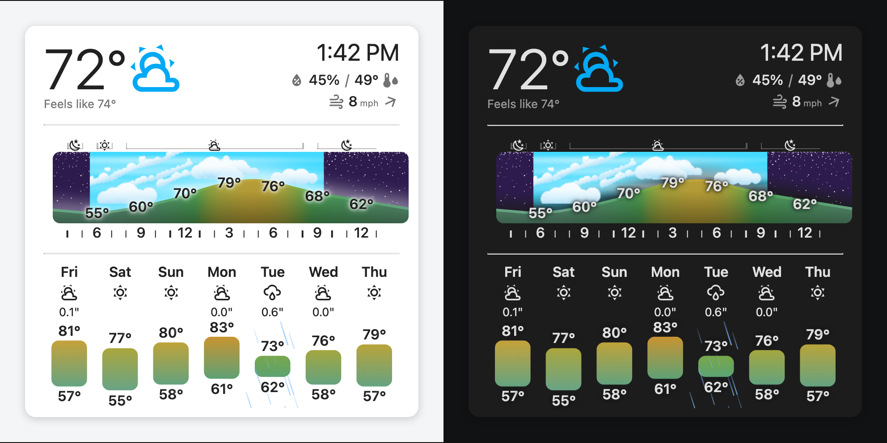

# Display Weather



A Home Assistant custom card designed for wall-mounted displays. Shows current
conditions plus hourly and daily forecast charts.

## Features

- Current temperature, humidity, and conditions
- Hourly forecast chart with realistic sky-rendered clouds and precipitation
- Daily forecast chart
- Sky color rendering tied to sunrise/sunset
- Three sizes (small / medium / large)
- Bundles into a single `display-weather.js` for HACS distribution

## How conditions are shown

Rather than icons, the hourly chart renders conditions as an actual sky:


- **Daytime** shows clouds. Cloud type, altitude, and coverage are inferred from
  cloud cover, humidity, wind, and nearby hours (including hours before and
  after), so the shapes are a prediction of what the sky will actually look
  like: puffy cumulus on a fair afternoon, a lumpy stratocumulus deck, a
  thickening cirrus veil ahead of a front, or a cumulonimbus tower for a
  storm.
- **Nighttime** shows stars instead of clouds. Star density tracks cloud
  cover, so a clear night is dense with stars and a cloudy night is nearly
  starless — starryness is a read on sky clarity.
- **Haze** washes the horizon based on dew point (temperature + humidity),
  so hot muggy air reads visibly hazy while the same humidity in cold air
  stays crisp. Fog/haze conditions force it further.
- **Precipitation** falls as rain or snow particles over the affected hours,
  matching the forecasted precipitation type.

## Install

### HACS (custom repository)

1. HACS → three-dot menu → **Custom repositories**.
2. Add `https://github.com/stutrek/display-weather`, category **Dashboard**.
3. Search "Display Weather", install, restart HA.

### Manual

1. Download `display-weather.js` from the [latest release](https://github.com/stutrek/display-weather/releases).
2. Copy to `config/www/`.
3. Add as a Lovelace resource (`/local/display-weather.js`, type JavaScript Module).
4. Restart HA.

## Configuration

```yaml
type: custom:display-weather
entity: weather.forecast_home
size: medium          # 'small' | 'medium' | 'large' (default 'medium')
forecastEntity: weather.forecast_home_hourly  # optional, defaults to entity
```

| Option | Type | Required | Description |
|---|---|---|---|
| `entity` | `weather.*` entity id | Yes | Weather entity for current conditions |
| `forecastEntity` | `weather.*` entity id | No | Separate entity for forecasts; defaults to `entity` |
| `size` | `'small' \| 'medium' \| 'large'` | No | Card size, default `medium` |

## Development

```bash
pnpm install      # uses sibling pnpm workspace if set up (see preact-homeassistant)
pnpm dev
pnpm storybook    # :6007
pnpm test
pnpm build        # produces dist/display-weather.js
pnpm lint
```

## Release

Tag a `v*` release on `main`. The workflow at `.github/workflows/release.yml`
builds and attaches `display-weather.js` to the GitHub Release. HACS reads
from that release asset.

## License

MIT
